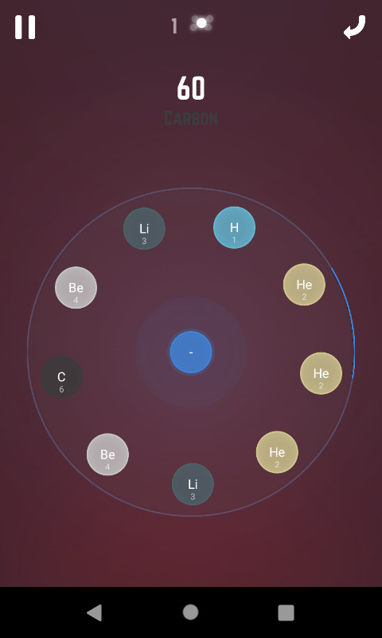
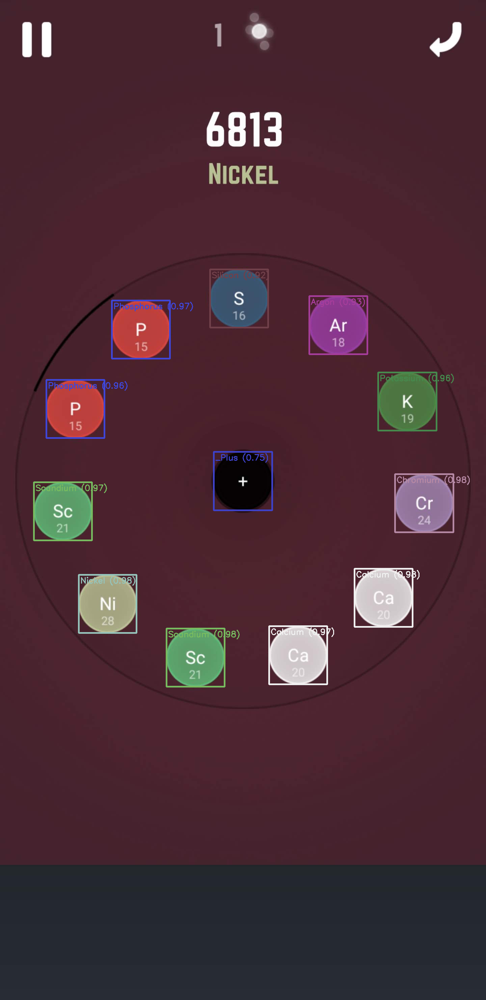

# Atomas

> Computer Vision-based game state detection and analysis for the mobile puzzle game Atomas

Atomas is a Rust-based toolkit that uses template matching and OpenCV to detect, parse, and analyze game states from screenshots of the Atomas mobile game. It extracts the ring configuration, player atom, and generates adjacency matrices for game state representation.

## 📸 Visual Overview

### Input: Game Screenshot


### Output: Detected Game State



## ✨ Features

- **Multi-Method Template Matching**: Laplacian gradients, Sobel, CLAHE, Canny edges
- **Robust Detection**: Handles uneven lighting and screen glare
- **Game State Parsing**: Extracts ring elements, player atom, and spatial relationships
- **Adjacency Matrix**: Graph representation of element connections
- **NMS Filtering**: Non-maximum suppression for clean detections
- **Android Emulator Support**: Docker-based Android environment included in testing/emulator

## 🚀 Quick Start

```bash
# Clone the repository
git clone https://github.com/yourusername/atomas.git
cd atomas

# Build the project
cargo build --release

# Run detection on a screenshot
cargo run --release
```

Place your game screenshot at `assets/jpg/board.jpg`. Detected output will be saved to `assets/png/outputs/`.

## 📁 Project Structure

```
atomas/
├── crates/
│   ├── atomas-core/      # Game logic, elements, ring structures
│   └── atomas-cv/        # Computer vision detection library
├── assets/
│   ├── txt/elements.txt  # Element database (118 elements + specials)
│   └── png/              # Template images for matching
├── docker/               # Android emulator environment
└── src/                  # Main application
```

## 🐳 Docker Emulator Setup

### Build the Docker Image

```bash
docker build -f docker/Dockerfile -t atomas-emulator .
```

### Run the Container

```bash
docker run -it --privileged \
  -p 5037:5037 \
  -p 5554-5585:5554-5585 \
  --name atomas-env \
  atomas-emulator
```

### Start the Android Emulator

Once inside the container:

```bash
# Start a single emulator (default)
/opt/start-emulator.sh

# Or configure multiple emulators
NUM_EMULATORS=2 /opt/start-emulator.sh

# Attach to the tmux session to monitor
tmux attach -t emulator
```

### Environment Variables

```bash
# Number of emulator instances
NUM_EMULATORS=1

# Android configuration
ANDROID_API_LEVEL=30
ANDROID_ABI=x86_64
ANDROID_DEVICE=pixel_6

# Display settings
DISPLAY_WIDTH=480
DISPLAY_HEIGHT=800
DISPLAY_DENSITY=213

# Resource allocation (per emulator)
OPT_MEMORY=512    # MB
OPT_CORES=2
```

### Managing AVDs

```bash
# List all AVDs
/opt/delete_avds.sh list

# Delete all AVDs
/opt/delete_avds.sh delete
```

## 📦 Dependencies

- **opencv** - Template matching and image processing
- **image** - Image I/O
- **serde** - Serialization
- **rand** - Random number generation

## 🧪 Testing

```bash
cargo test --all
```

## 🤝 Contributing

We welcome contributions! Please see [CONTRIBUTING.md](CONTRIBUTING.md) for guidelines.

## 📄 License

See [LICENSE](LICENSE)

---

**Note**: This project is for educational and research purposes. Atomas is a trademark of its respective owners.

---
