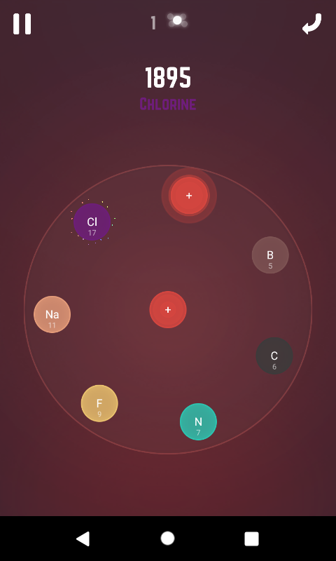
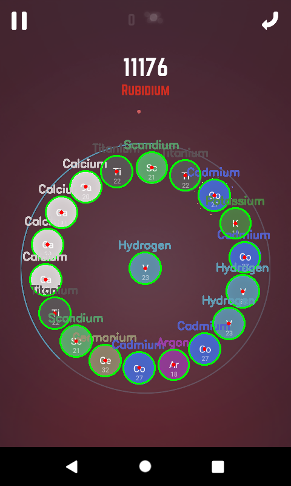

# Atomas

> Computer Vision-based game state detection and analysis for the mobile puzzle game Atomas

Atomas is a Rust AI helper that uses OpenCV to detect, parse, and analyze game states from screenshots of the Atomas mobile game. It extracts the ring configuration, player atom, and generates adjacency matrices for game state representation.

## 📸 Visual Overview

### Input: Game Screenshot


### Output: Detected Game State



## 🚀 Quick Start

```bash
git clone https://github.com/FanelliMarco/atomas.git
```
```bash
cd /atomas
```
```bash
docker build -t atomas:latest -f .\docker\Dockerfile .
```
```bash
docker run -p 5555:5555 --name atomas atomas:latest
```
```bash
docker exec -it atomas bash
```
```bash
root@16bc15bd1c35:/atomas# cd docker/scripts/
```
```bash
root@16bc15bd1c35:/atomas/docker/scripts# tmux new-session -t avd
```
```bash
root@16bc15bd1c35:/atomas/docker/scripts# ./start-emulator.sh
```
```bash
Ctrl+b d //Detach from session
```
```bash
root@16bc15bd1c35:/atomas# cargo run --release --bin milestone2 -- --adb --device emulator-5554 --moves 10 --solver expectimax --solver-depth 3
```

## 📁 Project Structure

```
atomas/
├── crates/
│   ├── atomas-core/      # Game logic, elements, ring structures
│   └── atomas-cv/        # Computer vision detection library
├── assets/
│   ├── txt/elements.txt  # Element database (118 elements + specials)
│   └── png/              # Template images for matching
├── docker/               # Android emulator environment
└── src/                  # Main application
```

## 🤝 Contributing

We welcome contributions! Please see [CONTRIBUTING.md](CONTRIBUTING.md) for guidelines.

## 📄 License

See [LICENSE](LICENSE)

---

**Note**: This project is for educational and research purposes. Atomas is a trademark of its respective owners.

---
